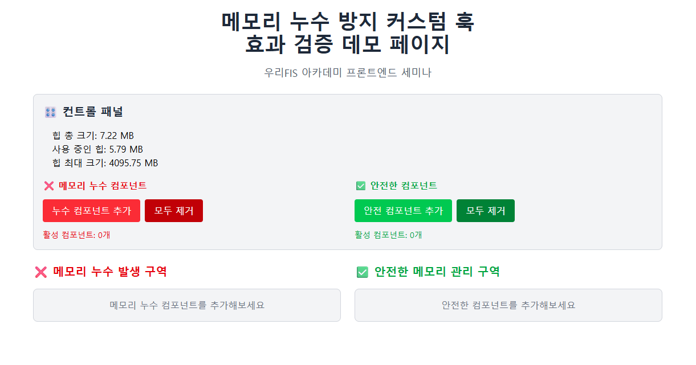
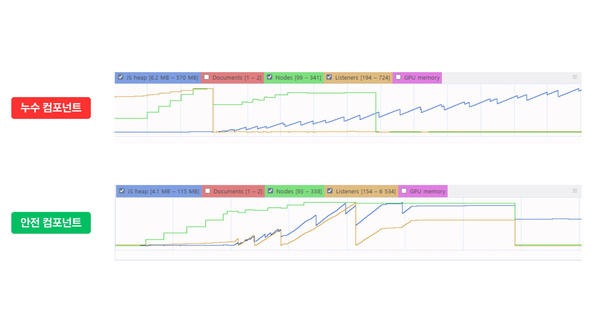

# Custom Hook Demo - Memory Leak Prevention Validation



## 📋 개요

React 애플리케이션에서 발생할 수 있는 메모리 누수를 방지하는 `leakguard-hooks` 라이브러리의 효과를 실증적으로 검증하는 데모 프로젝트입니다. Chrome DevTools의 Performance 및 Memory 탭을 활용하여 메모리 누수 발생 컴포넌트와 안전한 컴포넌트 간의 성능 차이를 시각적으로 비교할 수 있습니다.

## 🔗 관련 링크

- **NPM Package**: [leakguard-safe-hooks](https://www.npmjs.com/package/leakguard-safe-hooks)
- **GitHub Repository**: [leakguard-hooks](https://github.com/noeyigg/leakguard-hooks)

## 🎯 프로젝트 목적

- **메모리 누수 패턴** 이해 및 시연
- **leakguard-hooks 라이브러리**의 효과 검증
- **Chrome DevTools**를 활용한 메모리 프로파일링 학습
- **React 컴포넌트 생명주기**와 메모리 관리 모범 사례 학습

## 🔧 주요 기능

### LeakyComponent (메모리 누수 발생)
- ❌ **이벤트 리스너** 정리 없이 등록만 수행
- ❌ **setInterval** cleanup 없이 반복 실행
- ❌ **비동기 요청** AbortController 없이 처리
- ❌ 컴포넌트 언마운트 시에도 리소스가 계속 점유

### SafeComponent (안전한 메모리 관리)
- ✅ **useSafeEventListener** 자동 cleanup
- ✅ **useSafeSetInterval** 자동 cleanup  
- ✅ **useSafeAsync** AbortController 활용한 안전한 비동기 처리
- ✅ 컴포넌트 언마운트 시 모든 리소스 자동 정리

## 🚀 시작하기
### 로컬 실행
```bash
# 저장소 복제
git clone https://github.com/ye0ngeun/custom-hook-demo.git
cd memory-leak-demo

# 의존성 설치
npm install

# leakguard-safe-hooks 라이브러리가 이미 포함되어 있습니다
# npm install leakguard-safe-hooks

# 개발 서버 실행
npm run dev
```
### 데모 실행 방법
1. 브라우저에서 애플리케이션 열기
2. Chrome DevTools 열기 (F12)
3. Performance, Memory Tab 활용

## 📊 성능 검증 방법

### Performance Tab 분석
Chrome DevTools의 Performance 탭에서 Memory 오버레이를 활성화하여 다음 메트릭을 관찰:

- **JS Heap**: JavaScript 힙 메모리 사용량
- **Nodes**: DOM 노드 개수  
- **Listeners**: 이벤트 리스너 개수

#### 예상 결과
- **LeakyComponent**: 컴포넌트 제거 후에도 메모리 사용량이 지속적으로 증가
- **SafeComponent**: 컴포넌트 제거 시 메모리 사용량이 정상적으로 감소

### Memory Tab 분석 (Heap Snapshot)
다음 3단계로 나누어 힙 스냅샷을 비교:

1. **초기 상태**: 애플리케이션 로드 직후
2. **컴포넌트 마운트 + 이벤트 발생**: 컴포넌트 추가 후 사용자 상호작용
3. **컴포넌트 언마운트 + 이벤트 발생**: 컴포넌트 제거 후 추가 상호작용

#### 검증 포인트
- **LeakyComponent**: 언마운트 후에도 힙 메모리가 해제되지 않음
- **SafeComponent**: 언마운트 시 관련 메모리가 정상적으로 가비지 컬렉션됨

## 📈 실증 결과

### Chrome DevTools Performance Tab 분석



Performance 탭에서 Memory 오버레이를 활성화하여 레코딩하면 메모리 카운터 별 메모리 사용량을 확인할 수 있습니다:
- **파란색 (JS Heap)**: JavaScript 힙 메모리 사용량
- **초록색 (Nodes)**: DOM 노드 개수  
- **노란색 (Listeners)**: 이벤트 리스너 개수

#### 핵심 차이점: JS Heap 메모리 패턴
- **LeakyComponent**: 컴포넌트 언마운트 후에도 JS Heap이 계속 증가하며, GC 실행 시에도 메모리 회수가 제대로 이루어지지 않음
- **SafeComponent**: 언마운트 시 참조가 올바르게 해제되어 GC 대상이 되므로 메모리 누수 없이 정상적인 메모리 회수 패턴 보임

### Chrome DevTools Memory Tab 분석  

#### 누수 컴포넌트


#### 안전 컴포넌트


힙 스냅샷 분석을 통한 메모리 누수 검증 방법:
1. **초기 상태** → 스냅샷 촬영
1. **컴포넌트 추가 + 이벤트 발생** → 스냅샷 촬영
2. **컴포넌트 언마운트** → 스냅샷 촬영  
3. **수동 GC 실행** → 스냅샷 촬영

> 각 순서마다 **수동 GC 실행**하여 GC 실행 상태 맞추기
>
> **최소 3회 이상 촬영**하여 메모리 변화 추이 관찰

#### 분석 결과
**LeakyComponent (누수 발생)**
- 언마운트 후에도 참조가 끊기지 않아 힙 메모리 지속 점유
- 수동 GC 실행 시에도 메모리 회수 불가
- 내부 로직에 의한 지속적인 메모리 증가 패턴

**SafeComponent (안전한 관리)**  
- 커스텀 훅의 cleanup 함수에 의해 참조 올바르게 해제
- GC 대상이 되어 메모리 정상 회수
- 언마운트 후 메모리 점유량 안정화

### 메모리 누수 방지 효과 입증
leakguard-hooks를 사용한 SafeComponent는:
- ✅ 컴포넌트 언마운트 시 이벤트 리스너 자동 해제
- ✅ 타이머 및 인터벌 자동 정리
- ✅ AbortController를 통한 비동기 요청 취소
- ✅ 개발 환경에서 누수 감지 및 경고 제공

### 성능 향상 효과
- 장시간 실행 시 메모리 사용량 안정화
- 가비지 컬렉션 효율성 개선
- 애플리케이션 응답성 유지

## 🛠️ 사용된 기술

### Core Technologies
- **React 19**: 최신 React 기능 활용
- **Vite**: 빠른 개발 서버 및 빌드
- **Tailwind CSS**: 유틸리티 우선 스타일링

### Custom Hooks
- **useSafeEventListener**: 안전한 이벤트 리스너 관리
- **useSafeSetInterval**: 안전한 타이머 관리  
- **useSafeAsync**: 안전한 비동기 요청 처리

### 개발 도구
- **Chrome DevTools**: 메모리 프로파일링
- **Performance API**: 실시간 메모리 모니터링

## 📝 결론

leakguard-hooks 라이브러리를 통해 React 애플리케이션의 메모리 누수를 효과적으로 방지할 수 있음을 실증적으로 검증했습니다. 특히 Chrome DevTools를 활용한 메모리 프로파일링을 통해 라이브러리의 효과를 정량적으로 측정할 수 있었으며, 이는 프로덕션 환경에서의 애플리케이션 안정성과 성능 향상에 직접적으로 기여할 것으로 기대됩니다.

---

**우리FIS 아카데미 프론트엔드 세미나**  
React 렌더링 과정에서의 메모리 사용 분석과 최적화 전략:
JavaScript 동작 원리를 중심으로